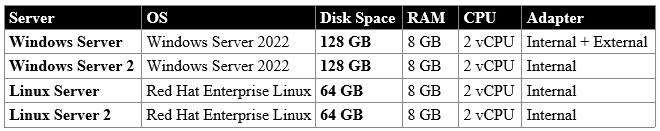

# Azure-Lab Configuration

Script that configures a full azure lab environment
Provisions a vNet, 4 VMs, key vault, automation account, NSG, and storage account

# VMs: 

# VM Specifications:

# Azure Tenant:

>Credentials: Sync@smhcomputers.com - Tenant ID: 2b0884e8-3366-4d15-9fb6-1971df9f4fc0

# Office 365 Tenant:
>Licensing: Business Basic - Grants access to Exchange, SharePoint, Teams, and OneDrive Tenants

>Credentials: Shane@smhcomputers.com - Tenant ID: Same as Azure Tenant
